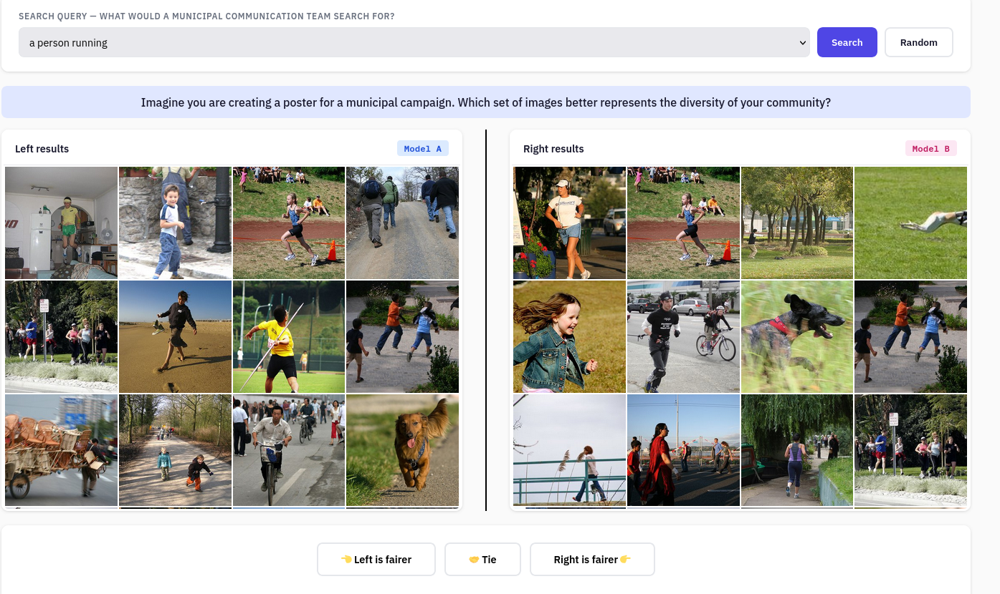

# Fairness Arena — CLIP Retrieval Fairness Evaluation

An LMSYS Chatbot Arena-style tool for evaluating the **fairness** of CLIP-based image retrieval models through human preference voting.

Participants see side-by-side image search results from two anonymous models, and vote for which set better represents the diversity of their community. Votes are aggregated using the Elo rating system to produce a fairness leaderboard.



## Quick Start

There are two ways to run the server: **live mode** (GPU machine does everything) or **bundle mode** (pre-compute on GPU, serve from any CPU machine). 

### Option A: Bundle mode

**Step 1 — On a GPU machine**, pre-compute all embeddings and retrieval results:

```bash
python3 -m venv venv
source venv/bin/activate
pip install -r requirements.txt

# Precompute the active dataset (defined by active_dataset_id in config)
python precompute.py

# Or precompute all datasets defined in config in one run
python precompute.py --all-datasets

# Or target a specific dataset by id
python precompute.py --dataset-id fairface
```

This loads every CLIP model (see how to config below), embeds all dataset images, computes retrieval rankings for all (model × query) pairs, creates web-ready thumbnails, and packs everything into a single portable `.npz` file per dataset (`data/arena_bundle_{dataset_id}.npz`). For 2000 images × 4 models, expect ~5-15 minutes per dataset.

**Step 2 — Copy the bundles** to your server (any machine, no GPU needed):

```bash
scp data/arena_bundle_*.npz yourserver:/path/to/fairness-arena/data/
```

**Step 3 — Run the server** (CPU-only, no PyTorch needed at runtime):

```bash
# Multi-dataset mode (recommended) — enables switching datasets from the admin panel
python server.py --bundles-dir data/ --admin-token my_secret

# Legacy single-bundle mode (still supported)
python server.py --bundle data/arena_bundle_flickr30k.npz --admin-token my_secret
```

The bundle contains thumbnails, all retrieval rankings, image embeddings (for open queries), and the config snapshot. Startup ta4kes a few seconds.

### Option B: Live mode (single GPU machine)

```bash
pip install -r requirements.txt
python server.py --admin-token my_secret
```

This loads models, downloads the dataset, and embeds everything at startup. Requires GPU and takes several minutes to start.

---

Open `http://localhost:8080` for the arena, `/admin` for the dashboard, `/leaderboard` for rankings.

## Architecture

```
                    ┌─────────────────────────────────┐
                    │   GPU machine (one-time)         │
                    │                                  │
                    │   precompute.py --all-datasets   │
                    │   ├── Load CLIP models           │
                    │   ├── Load dataset (HF/local)    │
                    │   ├── Embed all images           │
                    │   ├── Compute all retrievals     │
                    │   └── Save arena_bundle_{id}.npz │
                    │       (one bundle per dataset)   │
                    └──────────────┬───────────────────┘
                                   │ scp
                    ┌──────────────▼───────────────────┐
                    │   Server (CPU, AWS, etc.)         │
                    │                                  │
Browser ──────────► │   server.py --bundles-dir data/   │
(participant)       │   ├── Load active bundle (fast)  │
                    │   ├── Serve image thumbnails      │
Browser ──────────► │   ├── Serve retrieval results    │
(admin)             │   ├── Switch dataset at runtime  │
                    │   ├── Record votes (SQLite)      │
                    │   └── Compute Elo ratings        │
                    └──────────────────────────────────┘
```

## CLI Options

### `server.py`

| Flag | Default | Description |
|---|---|---|
| `--bundles-dir` | `None` | Directory containing per-dataset bundles (`arena_bundle_{id}.npz`). Enables dataset switching from the admin panel |
| `--bundle` | `None` | Path to a single pre-computed `.npz` bundle (legacy, still supported) |
| `--config` | `config/default_config.json` | Configuration file (used if no bundle or as overrides) |
| `--port` | `8080` | Server port |
| `--host` | `0.0.0.0` | Server host |
| `--device` | `auto` | PyTorch device (only relevant in live mode) |
| `--admin-token` | `changeme` | Token for admin API |

### `precompute.py`

| Flag | Default | Description |
|---|---|---|
| `--config` | `config/default_config.json` | Configuration file (defines models, datasets, queries) |
| `--dataset-id` | `None` | ID of a specific dataset to precompute (must match an entry in config `datasets`). Defaults to the active dataset |
| `--all-datasets` | `False` | Precompute bundles for all datasets defined in config |
| `--bundles-dir` | `data` | Output directory for bundle files |
| `--output` | `None` | Explicit output path (single dataset only; overrides `--bundles-dir`) |
| `--device` | `auto` | PyTorch device |
| `--thumbnail-size` | `400` | Max thumbnail dimension in pixels |
| `--batch-size` | `64` | Batch size for image embedding |

## Configuration

All settings are in `config/default_config.json` and can be changed live via the admin panel:

- **Elo parameters:** K-factor, initial rating
- **Arena settings:** images per model, grid layout, predefined queries, open queries toggle
- **Active dataset:** `arena.active_dataset_id` sets which dataset is loaded at startup
- **Judge question:** the prompt shown to participants
- **Why tags:** optional tags for qualitative feedback
- **Models:** list of CLIP models (open_clip backend)
- **Datasets:** list of datasets under `"datasets"` key — each with an `id`, `name`, `source`, and source-specific fields (`hf_repo` / `folder_path`)

Example datasets config:

```json
"arena": {
  "active_dataset_id": "flickr30k"
},
"datasets": [
  {
    "id": "flickr30k",
    "name": "Flickr 30K",
    "source": "huggingface",
    "hf_repo": "nlphuji/flickr30k",
    "hf_split": "test",
    "image_column": "image",
    "max_images": 1000
  },
  {
    "id": "fairface",
    "name": "FairFace",
    "source": "huggingface",
    "hf_repo": "HuggingFaceM4/FairFace",
    "hf_config": "0.25",
    "hf_split": "train",
    "image_column": "image",
    "max_images": 1000
  }
]
```

Custom local folders are supported too via `"source": "folder"` and `"folder_path": "/path/to/images"`.

## What's Inside a Bundle

Each `.npz` file produced by `precompute.py` contains:

- **JPEG thumbnails** of all dataset images (web-ready, no need to ship the original dataset)
- **Retrieval rankings** for every (model × query) pair (pre-computed, served instantly)
- **Image embeddings** per model in float16 (enables open queries without GPU — just NumPy matrix multiplication)
- **Config snapshot** (models, queries, dataset metadata)
- **Dataset id** so the server knows which dataset it belongs to

Typical bundle size: ~50-200 MB depending on dataset size and number of models.

## Key Design Decisions

- **Side-by-side layout** with randomised left/right assignment and position logging for bias detection
- **Pre-computed retrieval results** via portable bundle for GPU-free serving
- **Multi-dataset support** — define multiple datasets in config, precompute one bundle per dataset, and switch between them at runtime from the admin panel without restarting the server
- **Optional "why" tags** for qualitative signal alongside the quantitative vote
- **Bradley-Terry analysis** can be run post-hoc on the exported CSV for publishable confidence intervals
- **Admin dashboard** with real-time stats, position bias monitoring, dataset switching, and data export

## Project Structure

```
fairness-arena/
├── server.py              # FastAPI server (live or bundle mode)
├── precompute.py          # Offline: embed + retrieve + pack bundle
├── database.py            # SQLite + Elo logic
├── retrieval.py           # CLIP model loading + retrieval + bundle loading
├── requirements.txt
├── arena.service
├── config/
│   └── default_config.json
├── data/
│   ├── arena.db                      # Created at runtime (votes, ratings)
│   ├── arena_bundle_flickr30k.npz    # Created by precompute.py (one per dataset)
│   └── arena_bundle_fairface.npz
└── static/
    ├── arena.html          # Public voting interface
    ├── admin.html          # Admin dashboard
    └── leaderboard.html    # Public leaderboard
```

## (Optional) Configure the systemd service

```bash
# Edit the service file to set your SECRET_KEY
vi arena.service
# Change ADMIN_TOKEN to a random string (generate one with: python3 -c "import secrets; print(secrets.token_hex(32))")

# Install the service
sudo cp arena.service /etc/systemd/system/
sudo systemctl daemon-reload
sudo systemctl enable arena
sudo systemctl start arena

# Check it's running
sudo systemctl status arena

# View logs
sudo journalctl -u arena -f
```
### Useful commands
 
```bash
sudo systemctl restart arena      # Restart after config changes
sudo systemctl stop arena         # Stop the server
sudo journalctl -u arena --since "1 hour ago"  # Recent logs
```

## (Optional) Port forwarding (browser can access through port 80)
```bash
sudo sh -c 'echo "iptables -t nat -A PREROUTING -p tcp --dport 80 -j REDIRECT --to-port 8080" >> /etc/rc.local'
sudo chmod +x /etc/rc.local
```
