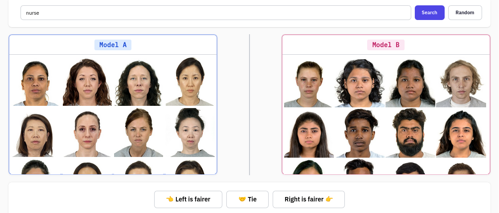

# Fairness Arena — CLIP Retrieval Fairness Evaluation

An LMSYS Chatbot Arena-style tool for evaluating the **fairness** of CLIP-based image retrieval models through human preference voting.

Participants see side-by-side image search results from two anonymous models, and vote for which set better represents the diversity of their community. Votes are aggregated using the Elo rating system to produce a fairness leaderboard.



## Quick Start

There are two ways to run the server: **live mode** (GPU machine does everything) or **bundle mode** (pre-compute on GPU, serve from any CPU machine). 

### Option A: Bundle mode

**Step 1 — On a GPU machine**, pre-compute all embeddings and retrieval results:

```bash
python3 -m venv venv
source venv/bin/activate
pip install -r requirements.txt

# Precompute the active dataset (defined by active_dataset_id in config)
python precompute.py

# Or precompute all datasets defined in config in one run
python precompute.py --all-datasets

# Or target a specific dataset by id
python precompute.py --dataset-id fairface
```

This loads every CLIP model (see how to config below), embeds all dataset images, computes retrieval rankings for all (model × query) pairs, creates web-ready thumbnails, and packs everything into a single portable `.npz` file per dataset (`data/arena_bundle_{dataset_id}.npz`). For 2000 images × 4 models, expect ~5-15 minutes per dataset.

**Step 2 — Copy the bundles** to your server (any machine, no GPU needed):

```bash
scp data/arena_bundle_*.npz yourserver:/path/to/fairness-arena/data/
```

**Step 3 — Run the server** (CPU-only, no PyTorch needed at runtime):

```bash
# Multi-dataset mode (recommended) — enables switching datasets from the admin panel
python server.py --bundles-dir data/ --admin-token my_secret

# Legacy single-bundle mode (still supported)
python server.py --bundle data/arena_bundle_flickr30k.npz --admin-token my_secret
```

The bundle contains thumbnails, all retrieval rankings, image embeddings (for open queries), and the config snapshot. Startup takes a few seconds.

### Option B: Live mode (single GPU machine)

```bash
pip install -r requirements.txt
python server.py --admin-token my_secret
```

This loads models, downloads the dataset, and embeds everything at startup. Requires GPU and takes several minutes to start.

---

Open `http://localhost:8080` for the arena, `/admin` for the dashboard, `/leaderboard` for rankings.

## Architecture

```
                    ┌─────────────────────────────────┐
                    │   GPU machine (one-time)         │
                    │                                  │
                    │   precompute.py --all-datasets   │
                    │   ├── Load CLIP models           │
                    │   ├── Load dataset (HF/local)    │
                    │   ├── Embed all images           │
                    │   ├── Compute all retrievals     │
                    │   └── Save arena_bundle_{id}.npz │
                    │       (one bundle per dataset)   │
                    └──────────────┬───────────────────┘
                                   │ scp
                    ┌──────────────▼───────────────────┐
                    │   Server (CPU, AWS, etc.)         │
                    │                                  │
Browser ──────────► │   server.py --bundles-dir data/   │
(participant)       │   ├── Load active bundle (fast)  │
                    │   ├── Serve image thumbnails      │
Browser ──────────► │   ├── Serve retrieval results    │
(admin)             │   ├── Switch dataset at runtime  │
                    │   ├── Record votes (SQLite)      │
                    │   └── Compute Elo ratings        │
                    └──────────────────────────────────┘
```

## CLI Options

### `server.py`

| Flag | Default | Description |
|---|---|---|
| `--bundles-dir` | `None` | Directory containing per-dataset bundles (`arena_bundle_{id}.npz`). Enables dataset switching from the admin panel |
| `--bundle` | `None` | Path to a single pre-computed `.npz` bundle (legacy, still supported) |
| `--config` | `config/default_config.json` | Configuration file (used if no bundle or as overrides) |
| `--port` | `8080` | Server port |
| `--host` | `0.0.0.0` | Server host |
| `--device` | `auto` | PyTorch device (only relevant in live mode) |
| `--admin-token` | `changeme` | Token for admin API |

### `precompute.py`

| Flag | Default | Description |
|---|---|---|
| `--config` | `config/default_config.json` | Configuration file (defines models, datasets) |
| `--queries` | `config/queries.txt` | Path to a text file with one query per line — these are baked into the bundle and shown in the UI dropdown |
| `--dataset-id` | `None` | ID of a specific dataset to precompute (must match an entry in config `datasets`). Defaults to the active dataset |
| `--all-datasets` | `False` | Precompute bundles for all datasets defined in config |
| `--bundles-dir` | `data` | Output directory for bundle files |
| `--output` | `None` | Explicit output path (single dataset only; overrides `--bundles-dir`) |
| `--device` | `auto` | PyTorch device |
| `--thumbnail-size` | `400` | Max thumbnail dimension in pixels |
| `--batch-size` | `64` | Batch size for image embedding |

## Configuration

Settings live in `config/default_config.json` (overridden at runtime by `config/active_config.json` if present, and editable via the admin panel):

- **Elo parameters:** `elo_k_factor`, `elo_initial_rating`
- **Arena layout:** `images_per_model`, `grid_columns`, `max_scroll_images`
- **Active dataset:** `active_dataset_id` — which dataset is loaded at startup
- **Search label:** `search_query_label` — text shown left of the query input (leave empty to hide)
- **Judge question:** `judge_question` — prompt shown above the grids (leave empty to hide)
- **Open queries:** `allow_open_queries` — if `true`, participants can type any free-text query (results are computed on-the-fly and cached in SQLite)
- **Matchmaking:** `matchmaking` — `"uniform"` picks model pairs at random
- **Why tags:** `enable_why_tags`, `why_tags` — optional qualitative feedback shown after a vote (15% of votes)
- **Models:** list of CLIP models (open_clip backend)
- **Datasets:** list of datasets under `"datasets"` key — each with an `id`, `name`, `source`, and source-specific fields (`hf_repo` / `folder_path`)

**Queries** (the dropdown shown to participants) are **not** in the config JSON. They live in `config/queries.txt`, one query per line, and are baked into the bundle at precompute time. To add or change queries, edit `queries.txt` and re-run `precompute.py`.

Example datasets config:

```json
"arena": {
  "active_dataset_id": "flickr30k"
},
"datasets": [
  {
    "id": "flickr30k",
    "name": "Flickr 30K",
    "source": "huggingface",
    "hf_repo": "nlphuji/flickr30k",
    "hf_split": "test",
    "image_column": "image",
    "max_images": 1000
  },
  {
    "id": "fairface",
    "name": "FairFace",
    "source": "huggingface",
    "hf_repo": "HuggingFaceM4/FairFace",
    "hf_config": "0.25",
    "hf_split": "train",
    "image_column": "image",
    "max_images": 1000
  }
]
```

Custom local folders are supported too via `"source": "folder"` and `"folder_path": "/path/to/images"`.

## What's Inside a Bundle

Each `.npz` file produced by `precompute.py` contains:

- **JPEG thumbnails** of all dataset images (web-ready, no need to ship the original dataset)
- **Retrieval rankings** for every (model × query) pair (pre-computed, served instantly)
- **Image embeddings** per model in float16 (enables open queries without GPU — just NumPy matrix multiplication)
- **Config snapshot** (models, queries, dataset metadata)
- **Dataset id** so the server knows which dataset it belongs to

Typical bundle size: ~50-200 MB depending on dataset size and number of models.

## Key Design Decisions

- **Side-by-side layout** with randomised left/right assignment and position logging for bias detection
- **Pre-computed retrieval results** via portable bundle for GPU-free serving
- **Multi-dataset support** — define multiple datasets in config, precompute one bundle per dataset, and switch between them at runtime from the admin panel without restarting the server
- **Optional "why" tags** for qualitative signal alongside the quantitative vote
- **Bradley-Terry analysis** can be run post-hoc on the exported CSV for publishable confidence intervals
- **Admin dashboard** with real-time stats, position bias monitoring, dataset switching, and data export

## Post-Workshop Analysis

After one or more sessions are complete, export votes from the admin panel ("Export analysis CSV") and run the analysis scripts from the `analysis/` folder.

### Quick results (votes CSV only)

```bash
cd analysis/

# Preference rates overall, per session, and per query
python win_rates.py --votes /path/to/fairness_arena_analysis.csv

# LaTeX table (model pair preference rates × session)
python generate_table.py --votes /path/to/fairness_arena_analysis.csv \
    --config ../config/default_config.json

# Chi-square test: do different sessions differ? (needs ≥ 2 sessions)
python community_analysis.py --votes /path/to/fairness_arena_analysis.csv
```

Outputs: `win_rates_overall.csv`, `win_rates_by_session.csv`, `win_rates_by_query.csv`, `results_table.tex`, `session_differences.csv`.

### Full pipeline (includes NDKL automated metrics)

Run these once per bundle (the face metadata is tied to the specific bundle):

```bash
cd analysis/

# 1. Generate face metadata from filenames stored in the bundle
python make_face_metadata.py --bundle ../data/arena_bundle_cfd.npz \
    --output ../data/face_metadata.csv

# 2. Compute NDKL fairness scores per vote
python compute_ndkl.py --votes /path/to/fairness_arena_analysis.csv \
    --bundle ../data/arena_bundle_cfd.npz \
    --metadata ../data/face_metadata.csv

# 3. Compute Spearman correlation between human votes and NDKL
python alignment_correlation.py --votes /path/to/fairness_arena_analysis.csv \
    --metrics automated_metrics.csv

# 4. Generate all tables and figures for the paper
python generate_all_tables.py
```

Outputs: `automated_metrics.csv`, `alignment_results.csv`, `table1_win_rates.csv`, `table2_by_session.csv`, `figure1_forest.png`, `figure2_heatmap.png`, `figure3_scatter.png`.

> **Note:** `make_face_metadata.py` reads filenames directly from the bundle, so the `image_id` mapping is always consistent with the rankings stored in the votes CSV. Re-run it if you rebuild the bundle.

## Multilingual UI & Open Query Translation

The voting interface is available in **English, Spanish, and Catalan**. Participants switch language with the EN / ES / CA buttons in the top-right corner. Predefined query labels are translated for display only — the English canonical key is always sent to CLIP, so retrieval results are unaffected by the UI language.

### Open queries in ES/CA

When a participant types a free query in Spanish or Catalan, the server automatically translates it to English before passing it to the CLIP text encoder. Translation is done via the **Scaleway Generative API** (Mistral-small, OpenAI-compatible).

**Required environment variable:**

```bash
export SCW_SECRET_KEY=your_scaleway_api_key
```

If you run the server inside a virtualenv, add the line to `venv/bin/activate` so it is set on every activation:

```bash
echo 'export SCW_SECRET_KEY=your_scaleway_api_key' >> venv/bin/activate
```

The server will return HTTP 503 for translation requests if the variable is not set.

**How it works:**

1. Participant types a query in ES/CA and hits Search.
2. The browser calls `POST /api/translate` with `{text, source_lang}`.
3. The server checks the database for an existing translation of that exact text+lang pair.
4. If none exists, it calls the Mistral API and stores the result as **pending**.
5. The translated English query is used immediately for CLIP retrieval for that participant.
6. A small hint (`→ nurse`) appears below the input field so the participant can see what was sent to the model.

**Quick test** (server must be running):

```bash
curl -s -X POST http://localhost:8080/api/translate \
  -H "Content-Type: application/json" \
  -d '{"text": "enfermera", "source_lang": "es"}' | python3 -m json.tool
# → {"translation": "nurse", "status": "pending"}
```

### Admin translation moderation

New translations are **pending** by default and are visible only to the participant who typed them. An admin must approve a translation before it appears in everyone's query suggestion list.

Open the admin panel → **"Open Query Translations"** section:

- **Pending** tab — translations waiting for review.
- You can edit the English text in the table before approving (e.g. to fix a mistranslation).
- Click **Approve** → the English translation is added to the shared query list for all participants.
- Click **Reject** → the query stays invisible to other participants.

Admin API endpoints (require `X-Admin-Token` header or `?token=` query param):

| Method | Path | Description |
|--------|------|-------------|
| `GET` | `/api/admin/translations?status=pending` | List translations (filter: `pending`, `approved`, `rejected`, or omit for all) |
| `POST` | `/api/admin/translations/{id}/approve` | Approve; optionally pass `{"translation": "edited text"}` in body |
| `POST` | `/api/admin/translations/{id}/reject` | Reject |

## Project Structure

```
fairness-arena/
├── server.py              # FastAPI server (live or bundle mode)
├── precompute.py          # Offline: embed + retrieve + pack bundle
├── database.py            # SQLite + Elo logic
├── retrieval.py           # CLIP model loading + retrieval + bundle loading
├── test_pipeline.py       # Integration + statistical tests
├── requirements.txt
├── arena.service
├── config/
│   ├── default_config.json   # Base configuration
│   ├── active_config.json    # Runtime overrides (created by admin panel)
│   └── queries.txt           # One query per line — baked into bundles at precompute time
├── data/
│   ├── arena.db                   # Created at runtime (votes, ratings)
│   ├── arena_bundle_cfd.npz       # Created by precompute.py (one per dataset)
│   └── face_metadata.csv          # Created by analysis/make_face_metadata.py
├── static/
│   ├── arena.html          # Public voting interface
│   ├── admin.html          # Admin dashboard
│   ├── results.html        # Live results (pair preference × session)
│   └── leaderboard.html    # Public leaderboard
└── analysis/
    ├── make_face_metadata.py      # Generate face_metadata.csv from bundle filenames
    ├── compute_ndkl.py            # Compute NDKL fairness scores per vote
    ├── alignment_correlation.py   # Human vs automated metric correlation
    ├── win_rates.py               # Win rates overall / by session / by query
    ├── community_analysis.py      # Chi-square test across sessions
    ├── generate_table.py          # LaTeX table from votes CSV
    └── generate_all_tables.py     # Aggregate tables + figures (full pipeline)
```

## (Optional) Configure the systemd service

```bash
# Edit the service file to set your SECRET_KEY
vi arena.service
# Change ADMIN_TOKEN to a random string (generate one with: python3 -c "import secrets; print(secrets.token_hex(32))")

# Install the service
sudo cp arena.service /etc/systemd/system/
sudo systemctl daemon-reload
sudo systemctl enable arena
sudo systemctl start arena

# Check it's running
sudo systemctl status arena

# View logs
sudo journalctl -u arena -f
```
### Useful commands
 
```bash
sudo systemctl restart arena      # Restart after config changes
sudo systemctl stop arena         # Stop the server
sudo journalctl -u arena --since "1 hour ago"  # Recent logs
```

## (Optional) Port forwarding (browser can access through port 80)
```bash
sudo sh -c 'echo "iptables -t nat -A PREROUTING -p tcp --dport 80 -j REDIRECT --to-port 8080" >> /etc/rc.local'
sudo chmod +x /etc/rc.local
```


## Funding Acknowledgement


Funded by the European Union. Views and opinions expressed are however those of the author(s) only and do not necessarily reflect those of the European Union or the European Education and Culture Executive Agency (EACEA). Neither the European Union nor EACEA can be held responsible for them.
